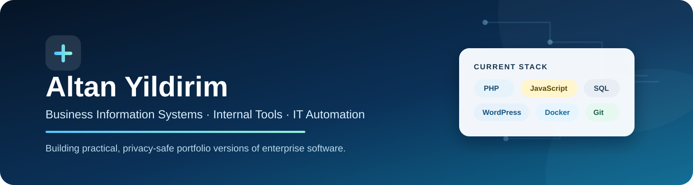

  

  
  

  
  
  
  
  

## About me

I study **Business Information Systems** and gain hands-on experience as an **IT working student**. I build practical internal tools that make IT processes easier to understand and use, especially in access governance, employee onboarding and service-desk workflows.

My portfolio focuses on independently rewritten, portable demonstrations of real-world product ideas. Each public project uses fictional data and excludes employer source code, production credentials, internal links and confidential records.

## Featured work

<table>
<tr>
<td width="50%" valign="top">

### [AccessHub](https://github.com/Altan-Y/access-governance-dashboard)

A permission-aware access-governance dashboard for exploring groups, job roles, owners and approvers.

`PHP` · `PDO` · `SQL` · `SQLite` · `Docker`

- secure sessions and CSRF protection;
- prepared SQL statements;
- authorized description editing;
- audit trail and CSV export.

</td>
<td width="50%" valign="top">

### [Interactive Employee Onboarding](https://github.com/Altan-Y/interactive-employee-onboarding)

A custom WordPress plugin for guided employee and guest onboarding across device and workplace scenarios.

`WordPress` · `PHP` · `JavaScript` · `MariaDB` · `Docker`

- employee and guest paths;
- Mac, Windows, office and remote branches;
- tutorial and responsive dark mode;
- generated WordPress pages and signed access cookie.

</td>
</tr>
<tr>
<td colspan="2" valign="top">

### [Freshservice Asset Context Demo](https://github.com/Altan-Y/freshservice-asset-context-demo)

A requester asset lookup for the ticket sidebar, presented through an original-style compact widget and a neutral service-desk preview.

`Freshworks FDK` · `JavaScript` · `HTML` · `CSS` · `Docker`

- Freshworks client initialization and activation handling;
- requester lookup from multiple ticket contexts;
- asset mapping, filtering and HTML escaping;
- loading, success, empty and error states.

</td>
</tr>
</table>

## What I work with

| Area | Technologies and tools |
|---|---|
| **Application development** | PHP, JavaScript, HTML, CSS, SQL, Java |
| **Platforms** | WordPress, Freshworks / Freshservice, SharePoint, Microsoft 365, Microsoft Intune |
| **Identity and data** | Active Directory, LDAPS, MySQL-compatible databases, SQLite |
| **Engineering workflow** | GitLab, GitHub, VS Code, Docker, GitHub Actions |

## Current focus

- designing clean and portable versions of enterprise-style tools;
- improving backend architecture, SQL and secure authentication patterns;
- connecting technical implementation with understandable business value;
- documenting production-versus-demo boundaries transparently.

> **Portfolio standard:** Public demos are independently rewritten, use synthetic data and do not contain proprietary employer code, production data, internal URLs or credentials. AI-assisted development may support prototyping, while code, security boundaries and technical claims are reviewed manually.

  <strong>Open to connecting about working-student opportunities, internal tools and product-oriented software development.</strong>

